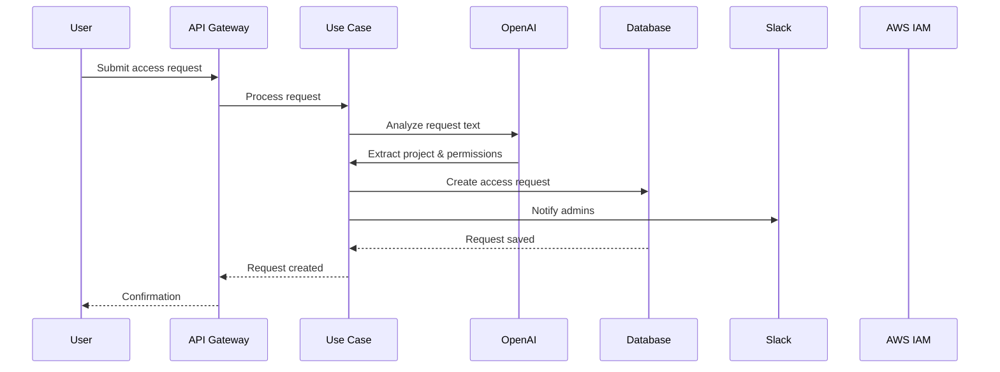
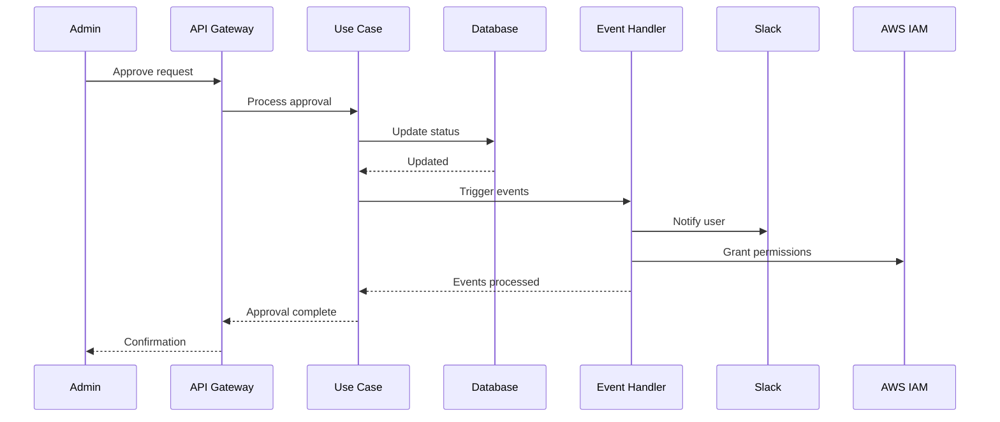

# Cloud Gatekeeper

A modern, event-driven access management system for cloud resources built with Domain-Driven Design principles and Clean Architecture.

## 🎯 What is Cloud Gatekeeper?

Cloud Gatekeeper is a sophisticated access control system that manages AWS resource permissions through an intelligent approval workflow. It provides a secure, auditable, and automated way to grant temporary access to cloud resources while maintaining compliance and security standards.

### Key Features

- **🔐 Intelligent Access Requests**: AI-powered analysis of access requests using OpenAI to extract project names and required permissions
- **📋 Approval Workflow**: Streamlined approval process with role-based access control
- **🤖 Automated AWS Integration**: Automatic IAM policy creation and resource discovery
- **📱 Slack Integration**: Real-time notifications and approval workflows via Slack
- **📊 Audit Trail**: Complete audit logging of all access requests and approvals
- **🛡️ Security First**: Built with security best practices and input validation

## 🏗️ Architecture Overview

Cloud Gatekeeper follows **Clean Architecture** and **Domain-Driven Design (DDD)** principles, ensuring maintainability, testability, and scalability.

### Architecture Layers

```
┌─────────────────────────────────────────────────────────────┐
│                    Presentation Layer                       │
│  ┌─────────────────┐  ┌─────────────────┐  ┌──────────────┐ │
│  │   HTTP Controllers │  │   Middleware    │  │   Validation │ │
│  └─────────────────┘  └─────────────────┘  └──────────────┘ │
└─────────────────────────────────────────────────────────────┘
┌─────────────────────────────────────────────────────────────┐
│                    Application Layer                        │
│  ┌─────────────────┐  ┌─────────────────┐  ┌──────────────┐ │
│  │   Use Cases     │  │   Event Handlers│  │   Subscribers │ │
│  └─────────────────┘  └─────────────────┘  └──────────────┘ │
└─────────────────────────────────────────────────────────────┘
┌─────────────────────────────────────────────────────────────┐
│                     Domain Layer                            │
│  ┌─────────────────┐  ┌─────────────────┐  ┌──────────────┐ │
│  │   Entities      │  │   Domain Events │  │   Value Objects│ │
│  └─────────────────┘  └─────────────────┘  └──────────────┘ │
└─────────────────────────────────────────────────────────────┘
┌─────────────────────────────────────────────────────────────┐
│                  Infrastructure Layer                       │
│  ┌─────────────────┐  ┌─────────────────┐  ┌──────────────┐ │
│  │   Database      │  │   External APIs │  │   Services   │ │
│  └─────────────────┘  └─────────────────┘  └──────────────┘ │
└─────────────────────────────────────────────────────────────┘
```

### Core Design Patterns

#### 1. **Domain Events Pattern**
The system uses a sophisticated event-driven architecture where domain events trigger side effects:

```typescript
// Domain events are emitted when business logic occurs
accessRequest.addDomainEvent(new AccessRequestApprovedEvent(accessRequest, approverId))

// Event handlers process these events asynchronously
@EventHandler
class OnAccessRequestApproved {
  async handle(event: AccessRequestApprovedEvent) {
    // Send Slack notification
    // Grant AWS permissions
    // Update audit logs
  }
}
```

#### 2. **Repository Pattern**
Data access is abstracted through repository interfaces:

```typescript
// Domain layer defines the contract
abstract class AccessRequestRepository {
  abstract create(accessRequest: AccessRequest): Promise<void>
  abstract findById(id: string): Promise<AccessRequest | null>
}

// Infrastructure layer implements the contract
class PrismaAccessRequestRepository extends AccessRequestRepository {
  async create(accessRequest: AccessRequest): Promise<void> {
    // Prisma implementation
  }
}
```

#### 3. **Use Case Pattern**
Business logic is encapsulated in use cases:

```typescript
@Injectable()
export class AccessRequestUseCase {
  async execute(request: AccessRequestUseCaseRequest): Promise<void> {
    // 1. Validate user exists
    // 2. Analyze request with AI
    // 3. Create access request
    // 4. Send notifications
  }
}
```

## 🛠️ Technology Stack

### Backend Framework
- **NestJS** - Progressive Node.js framework with TypeScript support
- **TypeScript** - Type-safe JavaScript for better developer experience

### Database & ORM
- **PostgreSQL** - Robust relational database
- **Prisma** - Type-safe database client and migrations
- **Redis** - Caching and session management

### Cloud Services
- **AWS SDK v3** - Modern AWS SDK for IAM and resource management
- **AWS IAM** - Identity and Access Management
- **AWS Resource Groups Tagging API** - Resource discovery and tagging

### AI & External Services
- **OpenAI API** - Natural language processing for request analysis
- **Slack API** - Real-time notifications and workflow integration

### Development Tools
- **Biome** - Fast formatter and linter
- **Vitest** - Fast unit testing framework
- **Docker** - Containerization for development and deployment

## 🏛️ Domain Model

### Core Entities

#### AccessRequest
The central entity representing a request for cloud resource access:

```typescript
class AccessRequest extends AggregateRoot<AccessRequestProps> {
  // Properties
  requesterId: string
  requesterEmail: string
  username: string
  project: string
  permissions: string[]
  status: 'PENDING' | 'APPROVED' | 'REJECTED'
  
  // Business methods
  approve(approverId: string): void
  reject(approverId: string, reason?: string): void
}
```

#### User
Represents system users with their roles and permissions:

```typescript
interface User {
  id: string           // Slack user ID
  email: string        // User email
  username: string     // AWS username
  isCloudAdmin: boolean // Admin privileges
}
```

### Domain Events

The system emits domain events for important business operations:

- **AccessRequestCreatedEvent** - When a new access request is submitted
- **AccessRequestApprovedEvent** - When an access request is approved
- **AccessRequestRejectedEvent** - When an access request is rejected

## 🔄 Workflow Architecture

### Access Request Flow



### Approval Flow



## 🔧 Key Components

### 1. **AI-Powered Request Analysis**
The system uses OpenAI to intelligently parse access requests:

```typescript
const openAiResponse = await this.openaiService.createCompletion(`
  Analyze this access request message and extract the project name and required AWS permissions.
  Return a JSON object with "project" and "permissions" fields.
  Message: "${message}"
`)
```

### 2. **AWS Resource Discovery**
Automatically discovers AWS resources based on project names:

```typescript
async discoverResourceByProject(projectName: string): Promise<string> {
  // Search by tags
  const taggedResources = await this.searchByTags(projectName)
  
  // Search by name
  const namedResources = await this.searchByName(projectName)
  
  // Use fallback pattern
  return `arn:aws:s3:::${projectName}/*`
}
```

### 3. **Event-Driven Notifications**
Slack notifications are triggered by domain events:

```typescript
@EventHandler
class OnAccessRequestApproved {
  async handle(event: AccessRequestApprovedEvent) {
    const message = this.buildApprovalNotification(event.accessRequest)
    await this.slackService.sendMessage({
      channel: event.accessRequest.requesterId,
      message
    })
  }
}
```

## 🧪 Testing Strategy

The project follows a comprehensive testing approach:

- **Unit Tests** - Test individual components and business logic
- **Integration Tests** - Test component interactions
- **E2E Tests** - Test complete workflows
- **Domain Event Tests** - Test event-driven behavior

## 🔒 Security Features

- **Input Validation** - Zod schema validation for all inputs
- **Role-Based Access Control** - Cloud admin role enforcement
- **Audit Logging** - Complete audit trail of all operations
- **Error Handling** - Graceful error handling without exposing sensitive data
- **Environment Configuration** - Secure configuration management

## 📈 Scalability Considerations

- **Event-Driven Architecture** - Loose coupling for horizontal scaling
- **Repository Pattern** - Easy database switching and optimization
- **Modular Design** - Independent service modules
- **Async Processing** - Non-blocking event handling
- **Caching Strategy** - Redis for performance optimization

## 🎨 Code Quality

- **Clean Architecture** - Separation of concerns
- **Domain-Driven Design** - Business-focused modeling
- **Type Safety** - Full TypeScript coverage
- **Code Formatting** - Biome for consistent code style
- **Linting** - Strict linting rules for code quality

This architecture ensures the system is maintainable, testable, and scalable while providing a robust foundation for cloud access management.
